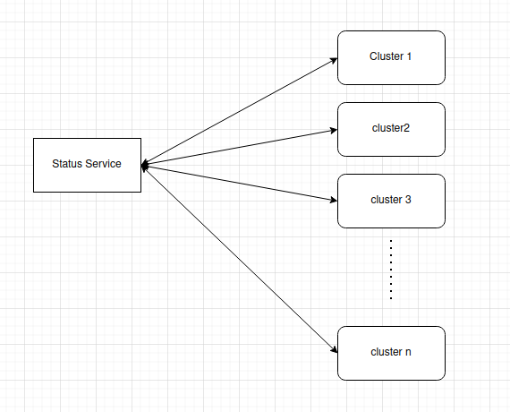

# Status Service

- Owner: Anand Totala (@anandt-huma)
- Reviewers: Compose Operator Maintainers
- Status: Draft, Revision 0.1

## Initial Use Cases
- Fetch the status of applications in a cluster
- Fetch the status of applications in a namespace.
- Fetch the status of applcation.(provided name/namespace/cluster).

## Design Proposal



- Creating a new service, which will expose API to fetch the information based on above use cases.
- Service will interact with kubernetes cluster API to fetch the details.
- Service will not interact directly with Huma compose-operator, thus removing the coupling between both the services.
- This service can be extended on future to more funvtionslity.
- Service need to have kubeconfig file with details of all the cluster where we will  be deploying application CR or 
  some other solution like OIDC to interact with multiple k8s clusters.
- If all the clusters are on GKE or some single cloud, a service account can be passed to status service, service can utilize go-sdk 
  for cloud provider and get the kubeconfig info or application details directly.

## Open Questions
 - Where this service weill be deployed ?

## Links
 - 

## Note
```
This is first draft of the service proposal and can be changed based on feedback recieved.

```
